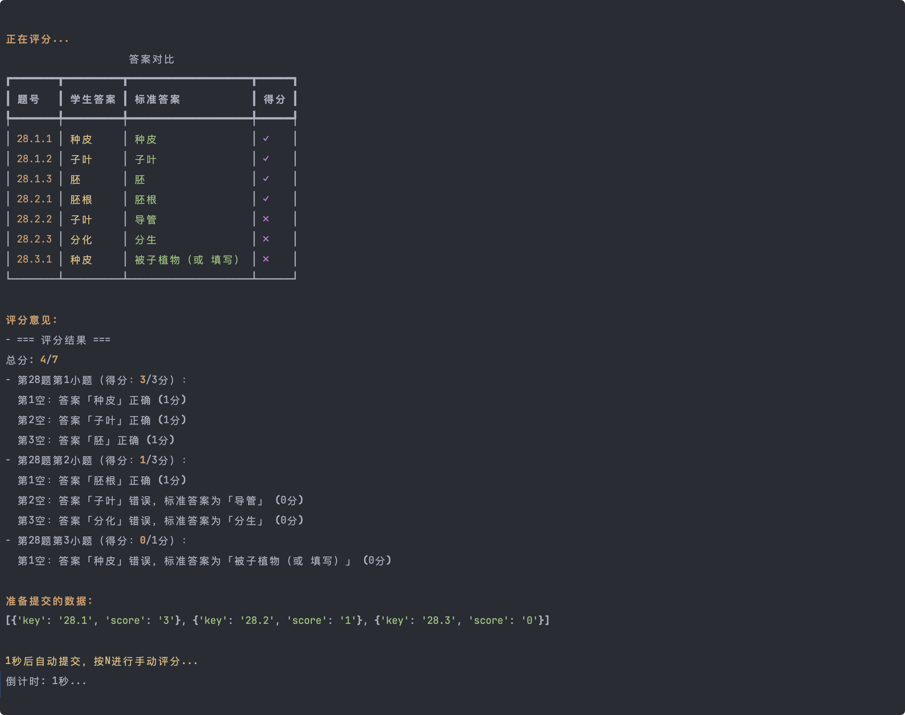

# 智能判题工具 (Exam Scorer)

一个基于智谱AI GLM-4V-Plus多模态大模型的智能判题工具，支持自动识别答案、智能评分，并与在线阅卷平台无缝对接。



## 主要功能

- 🔄 自动获取待阅试卷
- 📝 智能识别答案内容
- ✅ 自动评分与人工干预
- 🚀 快速提交评分结果
- 📊 实时显示评分进度
- 🤖 集成智谱AI，提供智能辅助

## 系统要求

- Python 3.8+
- 智谱AI API密钥

## 安装步骤

1. 克隆仓库：
```bash
git clone https://github.com/kirklin/exam-scorer.git
cd exam-scorer
```

2. 安装依赖：
```bash
pip install -r requirements.txt
```

## 配置说明

1. 创建`.env`文件，配置必要的环境变量：
```
ZHIPUAI_API_KEY=your_api_key_here
```

2. 在`main.py`中配置阅卷参数：
```python
subject_id = "your_subject_id"
block_id = "your_block_id"
```

3. 确保`data/standard_answer.json`包含正确的标准答案

## 使用方法

1. 启动程序：
```bash
python main.py
```

2. 系统会自动：
   - 获取待阅试卷
   - 下载答题图片
   - 识别答案内容
   - 进行自动评分

3. 评分过程中：
   - 系统会显示答案对比和评分结果
   - 默认3秒后自动提交
   - 按N键可进行手动评分

## 注意事项

- 请确保网络连接稳定
- 正确配置API密钥和cookies
- 建议定期检查标准答案是否更新
- 手动评分时请仔细核对分数

## 开发者

[Kirk Lin's GitHub](https://github.com/kirklin)

## 许可证

GPL-3.0 license 
